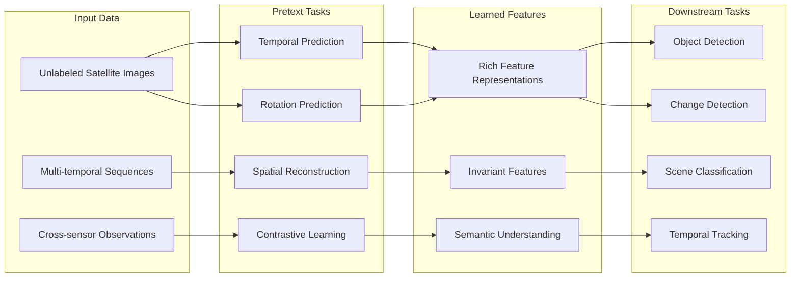

# Key Concepts

Understanding these fundamental concepts will help you make the most of SIT-FUSE's capabilities.

## Self-Supervised Learning

### Definition
Self-supervised learning enables the model to learn meaningful representations from data without requiring manually labeled examples. Instead, the model creates its own supervisory signal from the structure and relationships within the data.

### Self-Supervised Learning Process

### In SIT-FUSE Context
- **Temporal consistency** - Learning that the same location should have similar characteristics across nearby time periods
- **Spatial relationships** - Understanding how neighboring pixels relate to each other
- **Cross-sensor alignment** - Learning to associate similar features observed by different sensors

## Multi-Sensor Data Fusion

### Sensor Heterogeneity
Different earth observation sensors provide complementary information:

- **Temporal resolution** - How frequently observations are made
- **Spatial resolution** - The size of the smallest detectable feature
- **Spectral resolution** - The range and precision of electromagnetic spectrum coverage
- **Radiometric resolution** - The sensitivity to differences in energy

### Fusion Strategies
SIT-FUSE employs several fusion approaches:

1. **Early fusion** - Combining raw sensor data before processing
2. **Feature fusion** - Merging extracted features from individual sensors
3. **Decision fusion** - Combining results from sensor-specific analyses

## Instance Tracking

### Cross-Instrument Tracking
The ability to identify and follow the same environmental phenomenon across different sensors and time periods.

**Key challenges:**
- Different viewing angles and geometries
- Varying spectral responses
- Temporal gaps between observations
- Atmospheric interference

**SIT-FUSE solutions:**
- Contrastive learning to align features across sensors
- Temporal modeling to handle observation gaps
- Robust feature extraction invariant to viewing conditions

## Contrastive Learning

### Core Principle
Contrastive learning teaches the model to:
- **Pull together** representations of similar observations
- **Push apart** representations of different observations

### Application in Earth Observation
- **Positive pairs** - Same location observed by different sensors
- **Negative pairs** - Different locations or phenomena
- **Hard negatives** - Visually similar but different environmental features

### Benefits
- Improved feature quality without manual labels
- Better generalization across sensor types
- Robust performance in challenging conditions

## Environmental Phenomena Modeling

### Spatial-Temporal Dynamics
Environmental phenomena exhibit complex patterns:

- **Spatial extent** - Geographic coverage and boundaries
- **Temporal evolution** - How features change over time
- **Multi-scale behavior** - Phenomena operating at different scales simultaneously

### Feature Hierarchies
SIT-FUSE learns representations at multiple levels:

1. **Low-level features** - Edges, textures, spectral signatures
2. **Mid-level features** - Object parts, spatial patterns
3. **High-level features** - Complete objects, scene understanding

## Data Processing Pipeline

### Preprocessing
- **Geometric correction** - Aligning data to common coordinate systems
- **Radiometric calibration** - Converting raw measurements to physical units
- **Atmospheric correction** - Removing atmospheric effects
- **Cloud masking** - Identifying and handling cloud contamination

### Feature Extraction
- **Spectral analysis** - Leveraging wavelength-specific information
- **Texture analysis** - Capturing spatial patterns and relationships
- **Temporal analysis** - Modeling changes over time

### Post-processing
- **Spatial filtering** - Removing noise and artifacts
- **Temporal smoothing** - Ensuring consistency across time series
- **Uncertainty quantification** - Providing confidence estimates

## Performance Metrics

### Detection Accuracy
- **Precision** - Fraction of detected objects that are correct
- **Recall** - Fraction of actual objects that are detected
- **F1-Score** - Harmonic mean of precision and recall

### Tracking Performance
- **Identity preservation** - Maintaining object identity across time
- **Trajectory accuracy** - Correctness of tracked paths
- **Temporal consistency** - Smooth evolution of object properties

### Cross-Sensor Validation
- **Cross-sensor correlation** - Agreement between different sensors
- **Temporal alignment** - Synchronization of multi-sensor observations
- **Spatial registration** - Geometric alignment accuracy