# Project Overview

SIT-FUSE represents a breakthrough in automated earth observation analysis, combining state-of-the-art machine learning with multi-sensor data fusion to tackle some of the most pressing environmental monitoring challenges.

## The Challenge

Traditional earth observation workflows face several critical limitations:

- **Manual annotation bottlenecks** - Requiring extensive human labeling for each new sensor or application
- **Sensor-specific models** - Limited transferability between different satellite missions
- **Temporal inconsistency** - Difficulty tracking objects across time with varying observation conditions
- **Scale mismatches** - Challenges integrating data from sensors with different spatial and spectral resolutions

## The SIT-FUSE Solution

### System Overview

```mermaid
graph TB
    subgraph "Earth Observation Satellites"
        LEO[Low Earth Orbit<br/>Landsat, Sentinel, MODIS]
        GEO[Geostationary<br/>GOES, Himawari]
        SAR[Synthetic Aperture Radar<br/>Sentinel-1, ALOS]
    end
    
    subgraph "SIT-FUSE Framework"
        subgraph "Data Layer"
            Ingestion[Data Ingestion & Harmonization]
            Storage[Distributed Storage]
        end
        
        subgraph "ML Core"
            SSL[Self-Supervised Learning]
            Fusion[Multi-Sensor Fusion]
            Tracking[Instance Tracking]
        end
        
        subgraph "Applications"
            Fire[🔥 Wildfire Detection]
            Water[🌊 Water Quality]
            Land[🌍 Land Use Change]
            Atmosphere[💨 Atmospheric Tracking]
        end
    end
    
    subgraph "Outputs"
        Alerts[Real-time Alerts]
        Maps[Interactive Maps]
        API[RESTful APIs]
        Reports[Analysis Reports]
    end
    
    LEO --> Ingestion
    GEO --> Ingestion
    SAR --> Ingestion
    
    Ingestion --> Storage
    Storage --> SSL
    SSL --> Fusion
    Fusion --> Tracking
    
    Tracking --> Fire
    Tracking --> Water
    Tracking --> Land
    Tracking --> Atmosphere
    
    Fire --> Alerts
    Water --> Maps
    Land --> API
    Atmosphere --> Reports
```

### Self-Supervised Learning Architecture

SIT-FUSE employs advanced self-supervised learning techniques that learn meaningful representations from unlabeled multi-sensor imagery. This approach dramatically reduces the need for manual annotation while improving model generalization across diverse sensor types.

### Multi-Sensor Data Fusion

The framework creates a unified "sensor web" by intelligently combining observations from:

- **Geostationary satellites** (high temporal resolution)
- **Polar-orbiting satellites** (high spatial resolution)
- **Suborbital platforms** (specialized sensors)
- **Ground-based sensors** (validation data)

### Cross-Instrument Instance Tracking

Using contrastive learning techniques, SIT-FUSE can track the same environmental phenomena across different sensors and observation times, enabling:

- Consistent object identification across missions
- Temporal evolution analysis
- Cross-validation between sensor observations

## Technical Innovation

### Contrastive Learning Framework

The core innovation lies in the contrastive learning approach that learns to:
1. **Associate** similar environmental features across different sensors
2. **Distinguish** between different environmental phenomena
3. **Track** temporal changes in environmental conditions

### Adaptive Data Processing

SIT-FUSE handles the heterogeneity of multi-sensor data through:
- **Automatic preprocessing** for different data formats
- **Resolution harmonization** across sensors
- **Spectral band alignment** for consistent analysis

## Research Impact

SIT-FUSE has been validated in numerous real-world scenarios and has demonstrated significant improvements in:

- **Detection accuracy** - Superior performance compared to single-sensor approaches
- **Processing efficiency** - Reduced computational requirements through self-supervision
- **Operational readiness** - Direct applicability to operational monitoring systems

## Target Applications

The framework is designed for researchers, operational agencies, and organizations working in:

- **Climate monitoring** - Long-term environmental change detection
- **Disaster response** - Rapid assessment of wildfire, flooding, and volcanic activity
- **Agricultural monitoring** - Crop health and land use change analysis
- **Water resource management** - Monitoring of lakes, rivers, and coastal areas