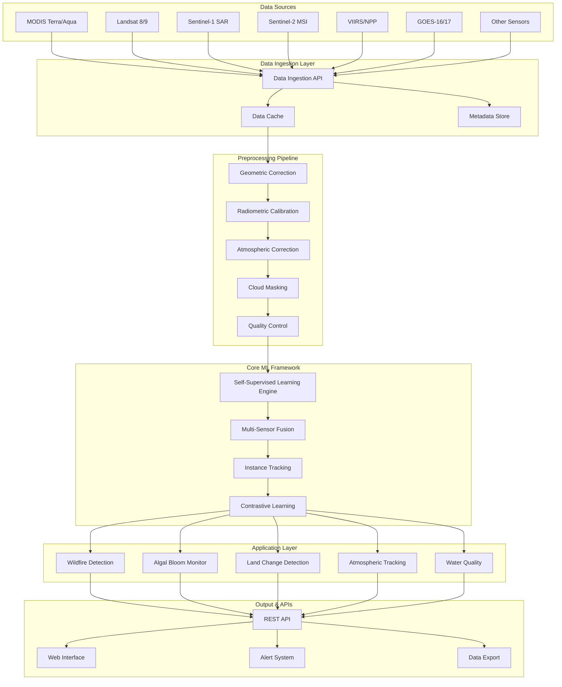
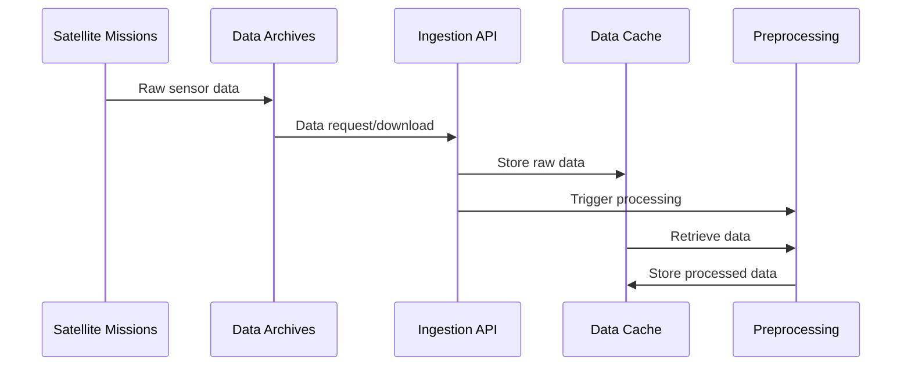
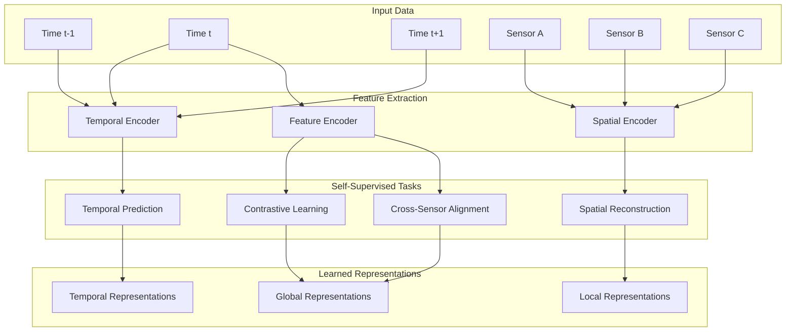
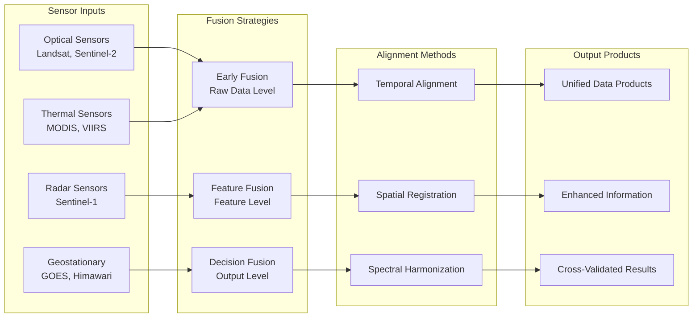
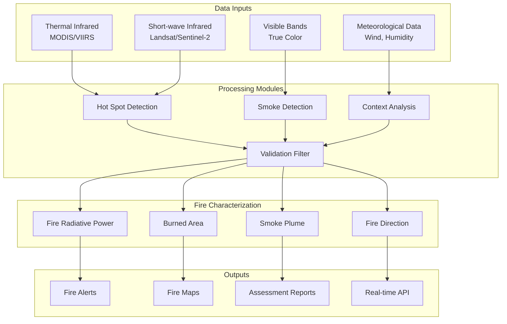
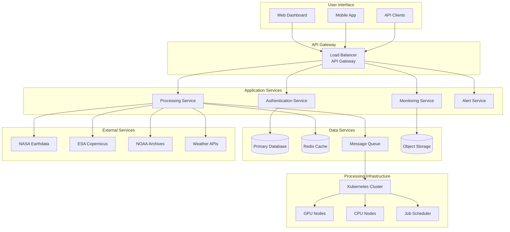

# SIT-FUSE System Architecture

This document outlines the comprehensive architecture of the SIT-FUSE framework, detailing how multi-sensor earth observation data flows through the system for automated environmental monitoring.

## Overview

SIT-FUSE implements a modular, scalable architecture that enables self-supervised learning across heterogeneous satellite sensor data. The system is designed to handle the complexity of multi-sensor fusion while maintaining flexibility for various environmental monitoring applications.

## High-Level Architecture

## Data Flow Architecture

The SIT-FUSE system processes satellite data through several distinct stages:

### 1. Data Acquisition & Ingestion

### 2. Preprocessing Pipeline

## Core Machine Learning Framework

### Self-Supervised Learning Engine

### Multi-Sensor Fusion Framework

## Application-Specific Architectures

### Wildfire Detection System

## Deployment Architecture

### Cloud-Native Deployment

## Technology Stack

| Layer | Technologies |
|-------|-------------|
| **Frontend** | React, TypeScript, Material-UI |
| **Backend** | Python, FastAPI, AsyncIO |
| **ML Framework** | PyTorch, Lightning, Weights & Biases |
| **Data Processing** | Apache Spark, Dask, NumPy |
| **Databases** | PostgreSQL, Redis, MongoDB |
| **Message Queue** | Apache Kafka, RabbitMQ |
| **Orchestration** | Kubernetes, Docker, Helm |
| **Monitoring** | Prometheus, Grafana, Jaeger |
| **Storage** | AWS S3, MinIO, HDFS |
| **CI/CD** | GitHub Actions, ArgoCD |

This architecture ensures SIT-FUSE can scale from research prototype to production-ready environmental monitoring system while maintaining flexibility for diverse applications and sensor configurations.