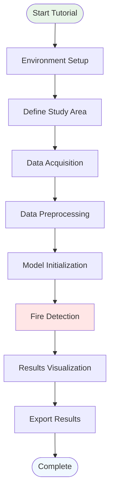
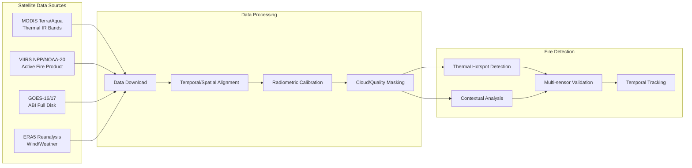

# Wildfire Detection Tutorial

This tutorial demonstrates how to use SIT-FUSE for automated wildfire and smoke plume detection using multi-sensor satellite imagery.

## Overview

Wildfire detection is one of SIT-FUSE's flagship applications, combining thermal infrared data, visible imagery, and meteorological information to provide rapid and accurate fire detection across large geographic areas.

## Workflow Overview



## Prerequisites

- SIT-FUSE installed with GPU support (recommended)
- NASA Earthdata account credentials
- Basic familiarity with Python and remote sensing concepts

## Data Requirements

For this tutorial, we'll use:
- **MODIS thermal bands** (Terra/Aqua satellites)
- **VIIRS active fire data** (Suomi-NPP/NOAA-20)
- **GOES-16/17 ABI data** (geostationary satellites)
- **ERA5 meteorological reanalysis** (wind speed/direction)

### Data Flow Diagram



## Step 1: Environment Setup

```python
import sit_fuse
from sit_fuse.applications import wildfire
from sit_fuse.data import SatelliteDataLoader
from sit_fuse.preprocessing import MultiSensorProcessor
import numpy as np
import matplotlib.pyplot as plt
from datetime import datetime, timedelta

# Configure the framework
config = sit_fuse.Config(
    cache_dir="./wildfire_data",
    use_gpu=True,
    num_workers=4
)
```

## Step 2: Define Study Area and Time Period

```python
# Define area of interest (California wine country)
aoi = {
    'bbox': [-123.5, 38.0, -122.0, 39.0],  # [west, south, east, north]
    'crs': 'EPSG:4326'
}

# Define time period (during 2020 fire season)
start_date = datetime(2020, 8, 15)
end_date = datetime(2020, 8, 25)

print(f"Study area: {aoi['bbox']}")
print(f"Time period: {start_date} to {end_date}")
```

## Step 3: Data Acquisition

```python
# Initialize data loader
data_loader = SatelliteDataLoader(config)

# Download multi-sensor data
datasets = data_loader.load_wildfire_data(
    aoi=aoi,
    start_date=start_date,
    end_date=end_date,
    sensors=['modis', 'viirs', 'goes-16', 'era5']
)

print(f"Downloaded {len(datasets)} datasets")
for sensor, data in datasets.items():
    print(f"  {sensor}: {data.shape} time steps")
```

## Step 4: Data Preprocessing

```python
# Initialize multi-sensor processor
processor = MultiSensorProcessor(config)

# Preprocess and align all sensors
processed_data = processor.process_wildfire_stack(
    datasets,
    target_resolution=1000,  # 1km spatial resolution
    temporal_window=1        # 1-hour temporal alignment
)

# Display processing results
print("Processed data structure:")
for key, value in processed_data.items():
    print(f"  {key}: {value.shape}")
```

## Step 5: Model Initialization

```python
# Load pre-trained wildfire detection model
wildfire_model = wildfire.WildfireDetector.from_pretrained(
    'sit-fuse-wildfire-v2.1',
    config=config
)

# Display model information
print(f"Model: {wildfire_model.name}")
print(f"Input channels: {wildfire_model.input_channels}")
print(f"Spatial resolution: {wildfire_model.native_resolution}m")
```

## Step 6: Fire Detection

```python
# Run wildfire detection
results = wildfire_model.detect(
    processed_data,
    confidence_threshold=0.7,
    minimum_fire_size=0.1,    # km²
    temporal_persistence=2     # hours
)

# Extract fire detections
fire_polygons = results['fire_polygons']
confidence_map = results['confidence_map']
fire_evolution = results['temporal_evolution']

print(f"Detected {len(fire_polygons)} fire areas")
print(f"Total burned area: {results['total_area']:.2f} km²")
```

## Step 7: Results Visualization

```python
import matplotlib.pyplot as plt
import matplotlib.patches as patches
from matplotlib.colors import ListedColormap

# Create visualization
fig, axes = plt.subplots(2, 2, figsize=(15, 12))

# Plot 1: RGB composite with fire detections
ax1 = axes[0, 0]
rgb_image = processed_data['rgb_composite']
ax1.imshow(rgb_image)
for fire in fire_polygons:
    poly = patches.Polygon(fire.exterior.coords, 
                          fill=False, edgecolor='red', linewidth=2)
    ax1.add_patch(poly)
ax1.set_title('RGB Composite with Fire Detections')
ax1.set_xlabel('Longitude')
ax1.set_ylabel('Latitude')

# Plot 2: Confidence map
ax2 = axes[0, 1]
im2 = ax2.imshow(confidence_map, cmap='hot', vmin=0, vmax=1)
ax2.set_title('Fire Detection Confidence')
plt.colorbar(im2, ax=ax2, label='Confidence')

# Plot 3: Temporal evolution
ax3 = axes[1, 0]
times = fire_evolution['timestamps']
areas = fire_evolution['burned_areas']
ax3.plot(times, areas, 'r-', linewidth=2, marker='o')
ax3.set_title('Fire Area Evolution')
ax3.set_xlabel('Time')
ax3.set_ylabel('Burned Area (km²)')
ax3.grid(True, alpha=0.3)

# Plot 4: Multi-sensor comparison
ax4 = axes[1, 1]
sensor_detections = results['sensor_comparison']
sensors = list(sensor_detections.keys())
accuracies = list(sensor_detections.values())
ax4.bar(sensors, accuracies)
ax4.set_title('Detection Accuracy by Sensor')
ax4.set_ylabel('Accuracy Score')
ax4.tick_params(axis='x', rotation=45)

plt.tight_layout()
plt.show()
```

## Step 8: Export Results

```python
# Export fire polygons to GeoJSON
import geopandas as gpd

# Convert to GeoDataFrame
fire_gdf = gpd.GeoDataFrame(
    [{'fire_id': i, 'area_km2': poly.area, 'confidence': conf}
     for i, (poly, conf) in enumerate(zip(fire_polygons, results['confidences']))],
    geometry=fire_polygons,
    crs='EPSG:4326'
)

# Save to file
fire_gdf.to_file('detected_fires.geojson', driver='GeoJSON')

# Export time series data
import pandas as pd
fire_timeseries = pd.DataFrame({
    'timestamp': fire_evolution['timestamps'],
    'burned_area_km2': fire_evolution['burned_areas'],
    'active_fires': fire_evolution['fire_counts']
})
fire_timeseries.to_csv('fire_evolution.csv', index=False)

print("Results exported:")
print("  - detected_fires.geojson")
print("  - fire_evolution.csv")
```

## Advanced Features

### Real-time Processing

```python
# Set up real-time monitoring
monitor = wildfire.RealtimeMonitor(
    aoi=aoi,
    model=wildfire_model,
    update_interval=15,  # minutes
    alert_threshold=0.8
)

# Start monitoring (runs in background)
monitor.start()

# Set up alert callback
def fire_alert(detection):
    print(f"🔥 FIRE ALERT: {detection['area']:.2f} km² at {detection['location']}")
    # Add your alert logic (email, SMS, etc.)

monitor.set_alert_callback(fire_alert)
```

### Cross-validation with Ground Truth

```python
# Load validation data (if available)
ground_truth = data_loader.load_ground_truth(
    aoi=aoi,
    start_date=start_date,
    end_date=end_date,
    source='modis_burned_area'
)

# Validate results
validation = wildfire_model.validate(
    predictions=results,
    ground_truth=ground_truth
)

print(f"Validation metrics:")
print(f"  Precision: {validation['precision']:.3f}")
print(f"  Recall: {validation['recall']:.3f}")
print(f"  F1-Score: {validation['f1_score']:.3f}")
```

## Troubleshooting

### Common Issues

1. **Low detection accuracy**
   - Check cloud coverage in your data
   - Verify sensor calibration
   - Adjust confidence threshold

2. **Missing data**
   - Ensure valid NASA Earthdata credentials
   - Check internet connectivity
   - Verify study area coordinates

3. **Memory errors**
   - Reduce spatial resolution
   - Process smaller time windows
   - Enable data streaming mode

### Performance Optimization

```python
# Enable performance optimizations
config.optimization.enable_mixed_precision = True
config.optimization.enable_gradient_checkpointing = True
config.optimization.batch_size = 8  # Adjust based on GPU memory

# Use data streaming for large areas
config.data.streaming_mode = True
config.data.chunk_size = '1GB'
```

## Next Steps

- Try the [Algal Bloom Detection Tutorial](./algal-bloom-analysis.md)
- Learn about [Multi-sensor Fusion](./multi-sensor-fusion.md)
- Explore [Advanced Use Cases](../use-cases/environmental-monitoring.md)
- Read about the [Technical Architecture](../technical-guide/architecture.md)

## Resources

- [MODIS Fire Products](https://modis.gsfc.nasa.gov/data/dataprod/mod14.php)
- [VIIRS Active Fire Data](https://www.earthdata.nasa.gov/earth-observation-data/near-real-time/firms)
- [GOES-R Fire Detection](https://www.goes-r.gov/products/baseline-fire.html)
- [Wildfire Detection Paper](../community/publications.md)